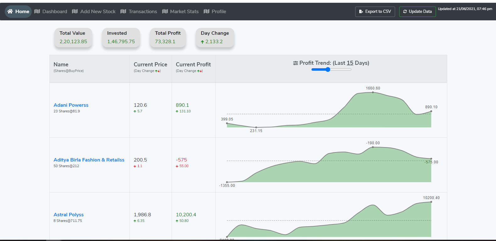
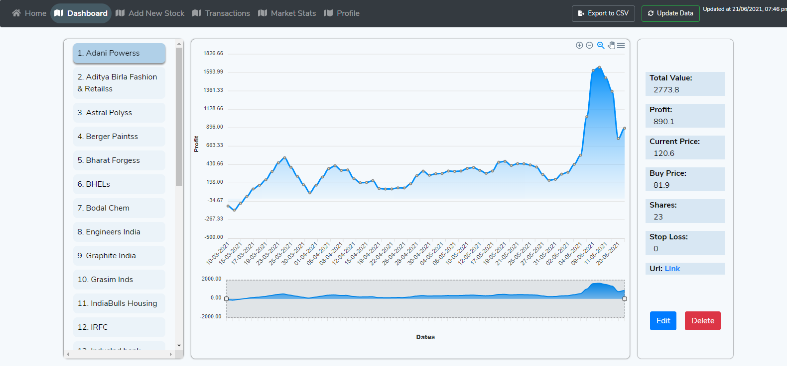
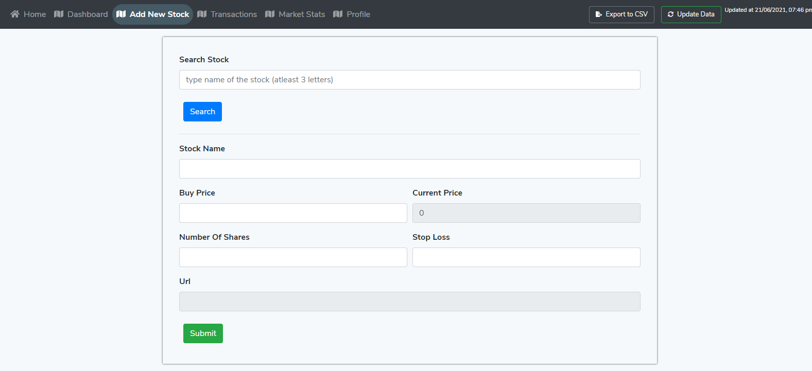

# Stocks-Tracker 
( work in progress )

A fullstack (MERN) application which will allow user to add stocks information on a dashboard.
Data will be scraped from MoneyControl.
User can add & modify information related to their stocks investment. 

## Demo Screenshots

**People say if you are looking for a project idea, just develop something to solve your own personal problem, and that's exactly what I did.**

From so long I wanted to develop a stocks tracker/management website for myself. Earlier I used to track my stocks investments locally in an excel sheet by scraping data from moneycontrol with help of a small python code I wrote.

Now, I'm very excited to share that I have built a MVP version of the stocks tracker/management dashboard.

Link: https://stocks-management.herokuapp.com/home
Tech: MERN stack.
StocksData: Scraped from Moneycontrol.

NOTE: Still working on adding many features and current version is for desktop only (not properly responsive yet). Data shown is dummy, not my actual investments.

Current Features::

Home Page:
1. View Overall/Invested/Profit/Day Change in stock prices.
2. Current Price & Current Profit with corresponding day change values.
3. Time series graph to show profit variation in last n days, use slider to change last days range.
4. Graph shows max/min/first/last points in a given range. On hover, tooltip shows profit for a specific day. 
4. Update latest stock data, show last updated time.
5. Download stocks data in as a CSV file.

AddNewStock Page:
1. Search a stock and select from dropdown. Values are auto-populated in main form to add in the database.

Upcoming features: 
1. Separate dashboard to view all the info related to a specific stock. Edit/Update each stock related information.
2. Show all transactions related to a stock.
3. Currently you have to manually update the data daily by clicking on the Update Data button, this will be automated using a cron job to update data at a specific time of the day.
3. Show various market stats.
4. Add JWT based authentication. Thus user specific profiles.
5. Manage data in local storage to reduce calls to backend.  
